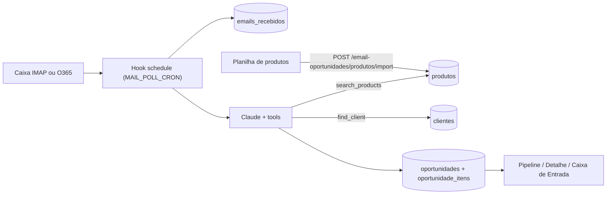

# Email → Oportunidades

A extensão Directus `email-oportunidades` lê a caixa comercial, usa o Claude para identificar pedidos de orçamento e os produtos pedidos, casa cada item com o catálogo (`produtos`, importado do Excel) e cria a oportunidade na coluna **Novo pedido** do Pipeline.



## Como funciona

1. A cada ciclo (padrão: 2 min) o hook pega um lock no Redis (`SET NX EX`) e busca até `MAIL_BATCH_SIZE` emails **não lidos** da pasta configurada.
2. Cada email é gravado em `emails_recebidos` (idempotente por `message_id`). Os anexos vão para `directus_files`.
3. O extrator (Claude, tool-use) classifica o email e, se for pedido de orçamento:
   - chama `find_client` (domínio do remetente / nome da empresa) na coleção `clientes`;
   - chama `search_products` para cada item: primeiro por código normalizado e depois por descrição, medidas e marca;
   - fecha com `emit_extraction` (validado com zod).
4. É criada uma oportunidade (`etapa=novo`, `origem=email`) com os itens:
   - `encontrado`: produto casado com confiança ≥ 0,8;
   - `ambiguo`: produto casado com confiança menor que 0,8;
   - `nao_encontrado`: sem produto no catálogo.

   Os outros candidatos que a IA considerou ficam em `alternativas`, para troca com um clique. `valor_estimado` é a soma de quantidade × preço dos itens casados. O vendedor é herdado do cliente, quando ele é identificado.
5. O email é marcado como lido e, se `MAIL_PROCESSED_FOLDER` estiver definido, movido para essa pasta. Se a extração falhar, o email fica com `status=erro` (marcado como lido, mas não movido) e pode ser reprocessado pela tela.

PDFs são enviados ao Claude como documentos. XLSX/XLS/ODS viram CSV e CSV/TXT vão como texto. Imagens e outros formatos são ignorados nesta versão e ficam listados em `extracao.anexos_ignorados`.

## Endpoints (`/email-oportunidades`)

| Método | Rota | Auth | Descrição |
|---|---|---|---|
| GET | `/health` | não | Provedor, cron, configuração faltante, última execução |
| POST | `/sync` | sim | Roda um ciclo agora (funciona mesmo com `EMAIL_INGEST_ENABLED=false`) |
| POST | `/emails/:id/reprocess` | sim | Refaz a extração; atualiza a oportunidade existente mantendo a etapa |
| POST | `/produtos/import` | sim | `{ rows: [{ <cabeçalho>: valor }], fonte? }` — upsert por `codigo` (máx. 5000 linhas por chamada) |

## Setup

```bash
npm run extension:install
npm run extension:build
npm run directus:bootstrap     # cria produtos, emails_recebidos, oportunidades, oportunidade_itens
docker compose restart directus
```

Depois:

1. Em **Produtos & preços**, importe a planilha do catálogo. Os cabeçalhos aceitos estão em [`docs/exemplos/README.md`](exemplos/README.md).
2. Configure a caixa no `.env` (veja abaixo) e ligue `EMAIL_INGEST_ENABLED=true`, ou use **Sincronizar agora** na Caixa de entrada.
3. Confira `GET /email-oportunidades/health`.

As novas coleções **não** têm leitura pública. Para roles que não são admin, conceda leitura/escrita em `oportunidades`, `oportunidade_itens`, `emails_recebidos` e `produtos` no Directus.

### IMAP

```bash
MAIL_PROVIDER=imap
IMAP_HOST=imap.gmail.com   # ou imap.locaweb.com.br, etc.
IMAP_PORT=993
IMAP_SECURE=true
IMAP_USER=comercial@empresa.com.br
IMAP_PASSWORD=...          # Gmail: senha de app
IMAP_FOLDER=INBOX
MAIL_PROCESSED_FOLDER=CRM-Processados
```

### Office 365 (Microsoft Graph)

1. No Entra ID (Azure AD), acesse **App registrations → New registration**.
2. Em **API permissions → Microsoft Graph → Application permissions**, adicione `Mail.ReadWrite` e clique em **Grant admin consent**.
3. Em **Certificates & secrets**, crie um client secret.
4. Recomendado: restrinja o app à caixa comercial com uma [Application Access Policy](https://learn.microsoft.com/graph/auth-limit-mailbox-access) (`New-ApplicationAccessPolicy`).

```bash
MAIL_PROVIDER=o365
O365_TENANT_ID=...
O365_CLIENT_ID=...
O365_CLIENT_SECRET=...
O365_MAILBOX=comercial@empresa.com.br
O365_FOLDER=inbox
MAIL_PROCESSED_FOLDER=CRM-Processados
```

O token é obtido por client credentials direto no endpoint OAuth da Microsoft, sem SDK.

## Calibrando com emails reais

```bash
npm run email:test-fixtures -- --dry        # parse + busca no catálogo, sem IA
npm run email:test-fixtures                 # extração completa com Claude (ANTHROPIC_API_KEY no .env)
npm run email:test-fixtures -- --only vale  # um arquivo
```

Os `.eml` ficam em `docs/exemplos/emails/`, o catálogo em `docs/exemplos/produtos/` e o resultado esperado em `docs/exemplos/emails/expected.json`. O prompt está em `directus/extensions/email-oportunidades/src/domain/prompts.ts`.

## Variáveis

| Variável | Padrão | Descrição |
|---|---|---|
| `EMAIL_INGEST_ENABLED` | `false` | Liga o cron |
| `MAIL_PROVIDER` | `imap` | `imap` ou `o365` |
| `MAIL_POLL_CRON` | `*/2 * * * *` | Frequência de leitura |
| `MAIL_BATCH_SIZE` | `20` | Máximo de emails por ciclo |
| `MAIL_PROCESSED_FOLDER` | vazio | Pasta de destino após processar |
| `EMAIL_MAX_ATTACHMENTS` | `5` | Anexos lidos por email |
| `EMAIL_MAX_ATTACHMENT_MB` | `10` | Tamanho máximo por anexo |
| `EMAIL_EXTRACTOR_MODEL` | `ANTHROPIC_MODEL` | Modelo da extração |
| `EMAIL_EXTRACTOR_MAX_TOKENS` | `4096` | |
| `EMAIL_EXTRACTOR_MAX_TOOL_ROUNDS` | `10` | Rodadas de tool-use antes de forçar `emit_extraction` |
